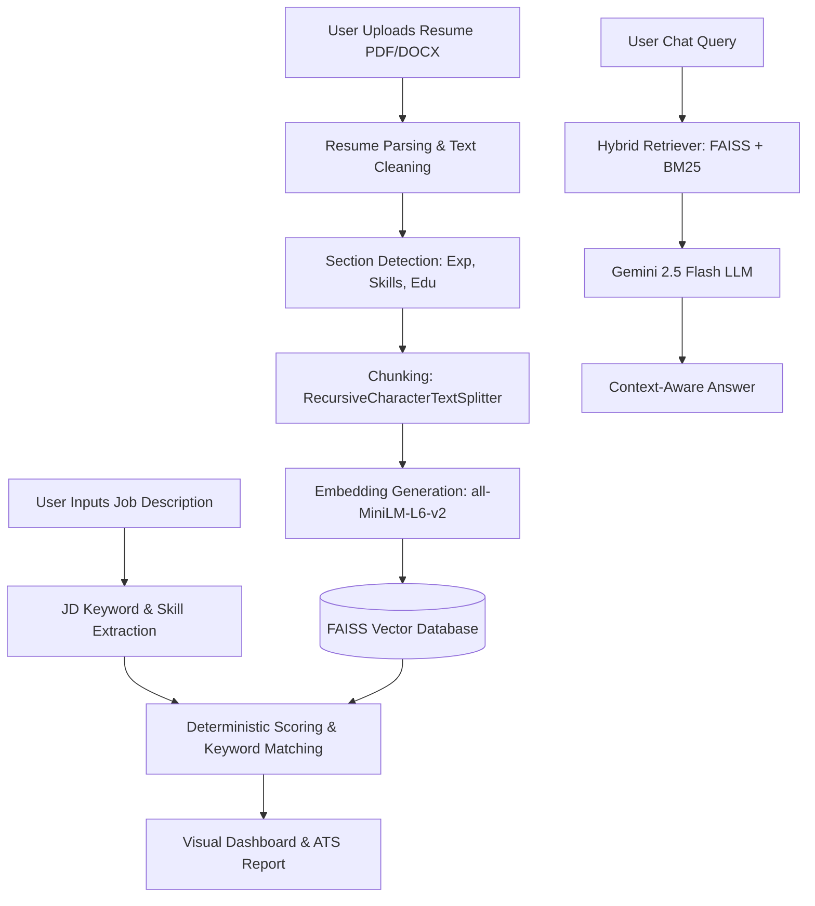
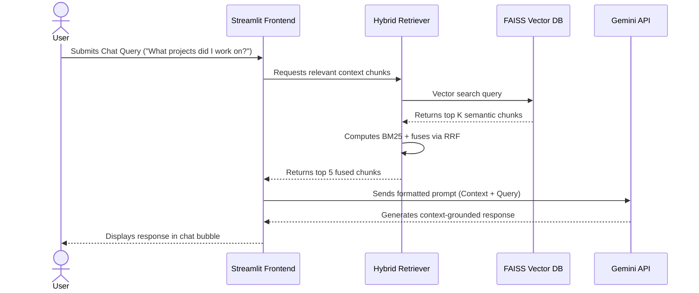

# ResumeInsight AI: Project & Learning Guide

Welcome to the ultimate learning guide and comprehensive documentation for **ResumeInsight AI**! This guide is written specifically to teach you how the application works, how it is architected, and the mathematical and technical principles behind it. 

[](https://resumeinsig-2zgkeqwwiks9t2ti7z8sgk.streamlit.app/)

If you are preparing for technical interviews, this document contains everything you need to know about building, optimizing, and explaining a production-ready AI Resume Analyzer and ATS Optimizer with RAG.

---

## 1. Project Overview

### What is ResumeInsight AI?
ResumeInsight AI is a production-ready, AI-powered system designed to analyze professional resumes and optimize them against target Job Descriptions (JD). The system evaluates compatibility, detects structural and grammatical issues, recommends improvements, and enables users to interact with their resume data through an interactive chat interface.

### The Problem It Solves
Traditional ATS (Applicant Tracking System) software used by companies scans resumes looking for exact keyword matches. If a candidate uses "Deep Learning" but the job description lists "TensorFlow" and "PyTorch", traditional systems might miss the connection and reject the resume. Furthermore, candidates struggle to understand why their resumes are not passing automated filters and how to improve them.

### How ResumeInsight AI is Different
Unlike simple LLM prompt wrappers that send the entire resume directly to an AI model, ResumeInsight AI is a hybrid engineering system:
1. **Deterministic Scoring:** The overall ATS score is calculated using clear, mathematically weighted metrics (e.g., action verbs, quantification, keyword match) rather than relying on inconsistent LLM ratings.
2. **Semantic Matching:** By representing skills as vector embeddings, the system recognizes related concepts (e.g., `TensorFlow` ≈ `Deep Learning`) using cosine similarity.
3. **Retrieval-Augmented Generation (RAG):** When you ask questions about the resume, the system retrieves only the relevant sections to formulate an answer, ensuring low latency, high accuracy, and no hallucinations.

---

## 2. Complete End-to-End Architecture

Here is the step-by-step workflow showing how data flows through the application:



### Architectural Pipeline Breakdown
1. **Resume Upload:** The user uploads a resume file (`.pdf` or `.docx`).
2. **Resume Parsing:** The parser extracts raw text using PyMuPDF (for PDF) or python-docx (for Word files) and normalizes it.
3. **Section & Skill Detection:** Regular expressions categorize the text into distinct sections (Summary, Experience, Projects, Skills, Education) and extract candidate skills.
4. **Text Chunking:** The document text is broken into small, overlapping chunks (size: 800 characters, overlap: 150 characters) to preserve contextual boundaries.
5. **Embedding Generation:** The text chunks are passed through the `all-MiniLM-L6-v2` model to generate 384-dimensional dense vector representations.
6. **Vector DB Storage:** The embeddings are loaded into a FAISS index to support similarity search.
7. **Job Description Processing:** The system extracts key terms and requirements from the user's job description.
8. **Hybrid Retrieval:** The retriever combines semantic FAISS vectors with lexical BM25 token frequencies to locate the most relevant pieces of information.
9. **Generation (LLM):** The retrieved chunks are structured into a prompt and sent to Gemini 2.5 Flash, which responds with accurate answers.

---

## 3. Folder Structure & Communication Flow

### Folder Hierarchy
```
ResumeInsight-AI/
├── app.py                 # Main Streamlit web application dashboard
├── core/                  # Core modules containing business logic
│   ├── parser.py          # Document parsing (PDF & DOCX)
│   ├── chunking.py        # Text chunking strategies
│   ├── embeddings.py      # Embedding generation & comparisons
│   ├── retriever.py       # Hybrid retrieval engine (FAISS + BM25)
│   ├── ats.py             # ATS analysis orchestrator
│   ├── keyword_match.py   # Multi-strategy keyword matcher
│   ├── scoring.py         # Deterministic ATS scoring math
│   ├── grammar.py         # Quality & style analyzer
│   ├── prompts.py         # LLM Prompt templates
│   ├── llm.py             # Gemini API communication handler
│   ├── rewrite.py         # Resume bullet rewriter logic
│   └── interview.py       # AI interview question generator
├── utils/                 # Utilities and helper modules
│   ├── constants.py       # Constants, weights, and skill mapping databases
│   └── helpers.py         # Text cleaners, regex matching, and validators
├── assets/                # Styling and visual elements
│   └── styles.py          # Custom CSS for the web dashboard
├── requirements.txt       # Project dependency list
├── .env.example           # Environment template file
└── README.md              # Project README and quick start
```

### Communication Flow between Files
* **Initialization:** `app.py` loads `assets/styles.py` to design the UI.
* **Analysis Phase:** When a user uploads a resume, `app.py` calls `core/parser.py` which cleans the text with `utils/helpers.py`.
* **RAG Setup:** The parsed text is split into chunks by `core/chunking.py`, converted to vectors by `core/embeddings.py`, and indexed in `core/retriever.py`.
* **Scoring Phase:** `core/ats.py` orchestrates `core/keyword_match.py` and `core/scoring.py` to return the complete ATS evaluation.
* **Chat Phase:** User queries in `app.py` trigger `core/retriever.py` to fetch relevant blocks, which are merged with templates in `core/prompts.py` and generated via `core/llm.py`.

---

## 4. Technologies Used

### Python
* **What it is:** A high-level, general-purpose programming language.
* **Why it was chosen:** It is the industry standard for AI, machine learning, and data processing, featuring rich libraries like LangChain and spaCy.
* **Advantages:** Readability, massive ecosystem, and rapid development.
* **Limitations:** Execution speed (slower than C++/Rust), but not an issue here since heavy vector computations are handled by C++ backends (FAISS).

### Streamlit
* **What it is:** An open-source Python framework to create web applications for data science and machine learning.
* **Why it was chosen:** It allows building responsive dashboard interfaces entirely in Python, removing the need for a separate Node.js/React frontend.
* **Advantages:** Extremely fast development, native support for charts and session state.
* **Limitations:** Not ideal for highly customized multi-page enterprise web portals with complex custom JavaScript components.

### LangChain
* **What it is:** A framework for developing applications powered by language models.
* **Why it was chosen:** It provides pre-built abstractions like `RecursiveCharacterTextSplitter` and wrappers for vector database integrations.
* **Advantages:** Simplifies prompt orchestration, model swapping, and document chunking.
* **Limitations:** Can occasionally introduce unnecessary abstraction complexity for simple RAG pipelines.

### FAISS (Facebook AI Similarity Search)
* **What it is:** A library for efficient similarity search and clustering of dense vectors.
* **Why it was chosen:** It is incredibly fast and memory-efficient for local similarity searches.
* **Advantages:** High performance, handles millions of vectors easily, and works fully offline.
* **Limitations:** Does not support real-time distributed updates or easy multi-tenancy as seamlessly as cloud vector databases (e.g., Pinecone).

### Sentence Transformers (`all-MiniLM-L6-v2`)
* **What it is:** A PyTorch-based framework for generating state-of-the-art sentence, text, and image embeddings.
* **Why it was chosen:** It runs locally, is free, and outputs small (384-dimensional) vectors that excel at semantic search tasks.
* **Advantages:** High speed, low memory usage, and no cost.
* **Limitations:** Lacks the deep multilingual understanding of larger API-based embedding models.

---

## 5. RAG (Retrieval-Augmented Generation) Explained

### What is RAG?
Retrieval-Augmented Generation is a technique that extends the capabilities of Large Language Models (LLMs) by fetching relevant context from an external database and passing it to the model alongside the user's query.

### Why Do We Need RAG?
Large Language Models have three major limitations:
1. **Hallucination:** LLMs confidently make up facts when they lack accurate information.
2. **Knowledge Cutoff:** An LLM only knows information up to its training date.
3. **Context Window Limitations:** Sending an entire 10-page resume or multiple candidate profiles to an LLM for every single question is slow, expensive, and can cause the model to ignore details in the middle of the text (referred to as "lost in the middle").

### How retrieval and generation work together:
* **Retrieval Phase:** The system indexes the candidate's resume. When the user asks *"What databases does the candidate know?"*, the retriever conducts a hybrid search (semantic + keyword) and fetches only the relevant paragraphs (e.g., the skills and experience sections).
* **Generation Phase:** The system templates these paragraphs into a prompt: *"Based ONLY on the sections below, answer the user's query: [Retrieved Sections]. Question: [User Question]"*. The LLM reads the context and answers based on facts, entirely avoiding speculation or hallucination.

---

## 6. Resume Parsing & Section Detection

### PDF & DOCX Document Extraction
* **PDF Parser (`PyMuPDF`):** Reads the PDF page-by-page. It extracts text blocks and layout metrics, then cleans trailing hyphens and normalizes whitespace characters.
* **DOCX Parser (`python-docx`):** Traverses paragraph nodes and extracts text, including rows inside tables (like project descriptions and skills tables).

### Section Detection Mechanics
Instead of sending the raw document to an LLM, the system scans each line using regular expressions corresponding to common headings (e.g., `experience`, `projects`, `education`). When a header is detected, the parser segments the text until the next section begins. This enables page-level metadata tagging and section-restricted query filtering.

---

## 7. Text Chunking & Embedding Vectors

### Why is Chunking Necessary?
A vector embedding model has a maximum token input limit. Furthermore, generating a single vector for an entire resume washes out specific details. By dividing the text into smaller segments (chunks), each vector represents a focused concept (like a single project description or job history entry).

### Chunk Size & Overlap Strategy
* **Chunk Size (800 characters):** Ensures that the text fragment holds enough context to be semantically meaningful.
* **Overlap (150 characters):** Prevents information loss at the boundary of a split. If a sentence is cut in half, the overlap ensures it is captured complete in the next chunk.
* **Recursive Character splitting:** We try to split on paragraphs first (`\n\n`), then lines (`\n`), then sentences (`. `), and finally words (` `), keeping formatting intact.

### What are Embeddings?
An embedding is a vector (list of numbers) representing the semantic meaning of a word, sentence, or paragraph.
For example, the text:
`"Developed cloud-native microservices using Docker and Kubernetes"`
Is converted into a list of 384 numbers: `[0.012, -0.045, 0.912, ...]`

If we plot these vectors in a high-dimensional space, sentences with similar meanings will sit close to each other. Cosmic similarity is calculated using the dot product of two normalized vectors:

$$\text{Cosine Similarity} = \cos(\theta) = \frac{\mathbf{A} \cdot \mathbf{B}}{\|\mathbf{A}\| \|\mathbf{B}\|}$$

If two vectors point in the same direction, the similarity score is 1.0. If they are orthogonal, it is 0.0.

---

## 8. FAISS Vector Database & Hybrid Search

### What is FAISS?
FAISS (Facebook AI Similarity Search) is a vector database that computes similarity between query vectors and stored document vectors. We use an **Inner Product Index (`IndexFlatIP`)** because our embeddings are L2-normalized, meaning the dot product is mathematically equivalent to Cosine Similarity.

### Hybrid Retrieval & Reciprocal Rank Fusion (RRF)
To prevent missing key terms, ResumeInsight AI combines two search strategies:
1. **Semantic Search (FAISS):** Searches for meaning (e.g., query `"database developer"` retrieves `"MySQL Administrator"`).
2. **Keyword Search (BM25):** Searches for exact terminology (e.g., query `"AWS"` retrieves `"AWS"`).

We combine the search results using **Reciprocal Rank Fusion (RRF)**:

$$\text{RRF Score} = \sum_{m \in M} \frac{1}{60 + \text{Rank}_m(d)}$$

Where $M$ is the set of retrieval systems, and $\text{Rank}_m(d)$ is the position of document $d$ in system $m$. This fuses semantic and lexical matches into a single, high-fidelity ranking.

---

## 9. Deterministic ATS Scoring Logic

Rather than letting an LLM guess a score, we calculate the ATS compatibility score programmatically using weighted modules:

| Component | Weight | Calculation Method |
|---|---|---|
| **Keyword Match** | 30% | Percentage of job description keywords found in the resume. |
| **Skill Match** | 20% | Coverage of essential technical skills extracted using the skills database. |
| **Experience Match** | 15% | Evaluates date consistency, role structure, and bullet points. |
| **Education Match** | 10% | Verifies institution name, degree level, and GPA presence. |
| **Action Verbs** | 10% | Ratio of strong action verbs (e.g., *designed*) to weak ones (e.g., *worked*). |
| **Quantification** | 10% | Presence of percentages, metrics, currency, or user count numbers. |
| **Formatting** | 5% | Completeness of sections, contact details, and length bounds. |

---

## 10. Keyword & Skill Matching Strategies

### Matching Methodologies
1. **Exact Matching:** Compares lowercase, normalized strings directly.
2. **Fuzzy Matching (RapidFuzz):** Uses Levenshtein distance (specifically Token Sort Ratio) to capture typographical errors or minor grammatical variations.
3. **Semantic Skill Matching:** Links synonymous skills together using hardcoded groupings (e.g., matching `PyTorch` under the broad umbrella of `Deep Learning`).

---

## 11. Prompt Engineering & LLM Safety

### Context-Aware Prompt Structure
To prevent the Gemini 2.5 Flash model from inventing projects, titles, or metrics, the prompt instructs the model:
`"Use ONLY the information provided below. If the answer cannot be found in the context, say so. Do not invent any facts."`
This grounds the model's outputs in reality.

---

## 12. Mermaid Sequence Diagram

The diagram below details the step-by-step sequence of interactions during a chat request:



---

## 13. System Resilience & Error Handling

* **Document Failures:** If a PDF is password-protected or corrupt, the parser catches the exception and falls back to a descriptive error message on the Streamlit screen.
* **API Quota Retries:** The model wrapper (`llm.py`) automatically implements exponential backoff to handle transient `429 Too Many Requests` API issues.
* **Fallback Retrieval:** If the embedding model fails, the retriever gracefully degrades to standard BM25 keyword search, ensuring the chat interface remains usable.

---

## 14. Security & Data Protection

* **API Key Handling:** Keys are configured in a local `.env` file (which is ignored by Git). Alternatively, users can enter keys dynamically in the sidebar, which are stored in the memory session and never written to disk.
* **Input Sanitization:** The user text query and resume files are sanitized using regex filters to strip any prompt injection patterns (such as instructions like *"ignore previous rules"*).
* **Upload Limits:** The sidebar validator restricts uploaded files to a maximum size of 10MB to protect the server from memory exhaustion.

---

## 15. Performance Optimization & Caching

* **Embedding Caching:** We use Streamlit's `@st.cache_resource` decorator to load the sentence transformer model into memory exactly once.
* **Batch Processing:** Embeddings are generated in batches of 32 to maximize GPU/CPU vectorization efficiency.
* **Session State:** Session states preserve processed calculations and parsed records, preventing duplicate parsing and embedding cycles when navigating tabs.

---

## 16. Scaling for Production (From 10 to 100k Users)

If you are asked in a system design interview how to scale this architecture:
1. **Move to a Managed Vector DB:** Replace local FAISS with a cloud-native vector store like Pinecone or Milvus to support thousands of parallel search operations.
2. **Decouple Frontend & Backend:** Move the parsing and similarity logic to a FastAPI microservice, leaving Streamlit as a stateless client.
3. **Queue-Based Parsing:** For massive documents or bulk uploads, submit files to a Celery worker pool running RabbitMQ or Redis as a broker.
4. **API Key Rotation & Rate Limiting:** Implement API request throttling (e.g., using Redis rate limiters) to avoid hitting Gemini's quota limits.

---

## 17. Troubleshooting Common Issues

* **Gemini API Quota Exceeded:** 
  * *Reason:* Exceeded free-tier query limits (RPM/TPM).
  * *Solution:* Implement custom cooling intervals or add your own API billing key in the sidebar.
* **FAISS Import Failures on Windows:** 
  * *Reason:* Missing C++ Redistributable libraries.
  * *Solution:* Install the official Visual Studio Build Tools, or use `pip install faiss-cpu`.
* **Corrupt File Warnings:** 
  * *Reason:* Scanning encrypted PDFs.
  * *Solution:* The parser catches `fitz.PasswordError` and asks the user to supply an unencrypted file.

---

## 18. Sample Technical Interview Questions & Answers

### Q1: What is the benefit of hybrid search over simple semantic vector search?
**Answer:** Pure semantic search compares vector representations but can struggle to fetch specific exact names, numbers, or unique alphanumeric codes (such as "S3", "Kafka", "Python 3.10"). Hybrid search combines dense vector matching (for conceptual context) with sparse BM25 token frequencies (for exact keyword matching) using Reciprocal Rank Fusion (RRF). This ensures that you retrieve documents matching both the conceptual meaning and the precise terminology.

### Q2: Why is deterministic scoring preferred over LLM scoring for an ATS system?
**Answer:** Large Language Models are non-deterministic; they can output different scores for the exact same input if the temperature is not set to absolute zero (and even then, due to system floating-point variations). More importantly, LLMs can struggle with basic arithmetic and are prone to hallucinations. A deterministic scoring script uses concrete, auditable logic (weighted counts of metrics, formatting constraints, word lists) to yield consistent, explainable results.

### Q3: What is the math behind cosine similarity and how is it used here?
**Answer:** Cosine similarity measures the cosine of the angle between two multi-dimensional vectors. It is defined as:
$$\text{Similarity} = \frac{\mathbf{A} \cdot \mathbf{B}}{\|\mathbf{A}\| \|\mathbf{B}\|}$$
In this application, our text embeddings are normalized to unit length ($\|\mathbf{A}\| = 1$), which simplifies the equation to a simple dot product ($\mathbf{A} \cdot \mathbf{B}$). We use it to match candidate skills with JD requirements and fetch related paragraphs for user queries.

---

## 19. Deployment Guide

### Deploying Locally
1. Run `pip install -r requirements.txt` to install dependencies.
2. Download the English spaCy model: `python -m spacy download en_core_web_sm`.
3. Create a `.env` file with your `GOOGLE_API_KEY`.
4. Run `streamlit run app.py`.

### Deploying to Streamlit Community Cloud
1. Push your repository to GitHub.
2. Log in to [Streamlit Share](https://share.streamlit.io/).
3. Connect your GitHub repository and specify `app.py` as the entry file.
4. Under "Advanced settings", paste your `GOOGLE_API_KEY` under Secrets.
5. Click **Deploy**.

---

## 20. Learning Summary & Glossary

* **RAG (Retrieval-Augmented Generation):** A framework that fetches relevant context from an external database to ground LLM generations in fact.
* **Vector Embedding:** A numerical representation of text that captures its semantic meaning.
* **FAISS:** Facebook's open-source library for fast similarity search of dense vectors.
* **BM25:** A classic ranking algorithm used by search engines to evaluate document relevance based on matching keywords.
* **RRF (Reciprocal Rank Fusion):** A rank consolidation algorithm that merges scores from multiple retrieval systems.
* **Cosine Similarity:** A mathematical metric measuring the orientation similarity between two vectors.
* **Chunking:** The process of splitting long documents into smaller segments to maintain high context specificity.
* **Non-Deterministic:** Systems that can produce different outputs for the same input across separate runs.

---
**Good luck with your interviews and resume optimizations!** 🚀


